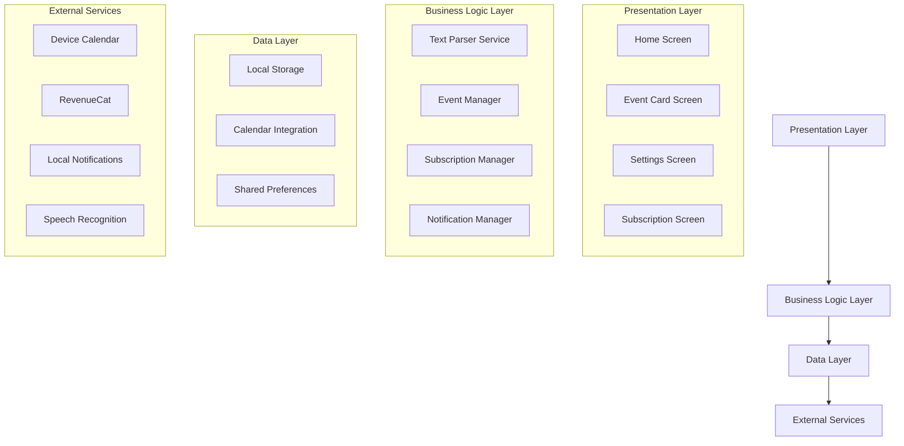

# Design Document

## Overview

AutoCal is a Flutter mobile application that automatically parses event information from shared text and creates calendar entries with offline reminder capabilities. The app follows a clean architecture pattern with clear separation between presentation, business logic, and data layers. It integrates with device calendars, implements local notifications for offline reminders, and uses RevenueCat for subscription management.

## Architecture

### High-Level Architecture



### Core Dependencies

The application will require the following Flutter packages:

- `receive_sharing_intent`: Handle shared content from other apps
- `device_calendar`: Calendar integration for reading/writing events
- `flutter_local_notifications`: Offline notification system
- `purchases_flutter`: RevenueCat integration for subscriptions
- `speech_to_text`: Voice input for Pro users
- `shared_preferences`: Local data persistence
- `intl`: Date/time parsing and formatting
- `provider` or `bloc`: State management
- `permission_handler`: Managing device permissions
- `tflite_flutter`: Offline AI model for meeting notes processing
- `path_provider`: Local file storage for AI models

## Components and Interfaces

### 1. Text Parser Service

**Purpose:** Extract dates, times, and locations from shared text content.

**Key Methods:**
- `parseEventFromText(String text) -> ParsedEvent`
- `extractDates(String text) -> List<DateTime>`
- `extractTimes(String text) -> List<TimeOfDay>`
- `extractLocations(String text) -> List<String>`

**Implementation Strategy:**
- Use regex patterns for common date/time formats
- Implement location detection using keyword matching
- Support multiple languages and date formats
- Provide confidence scores for parsed elements

### 2. Event Manager

**Purpose:** Manage event creation, editing, and calendar integration.

**Key Methods:**
- `createEvent(ParsedEvent event) -> Future<bool>`
- `saveToCalendar(Event event) -> Future<bool>`
- `validateEventData(Event event) -> ValidationResult`
- `checkDailyLimit() -> bool`

**State Management:**
- Track daily event count for free users
- Manage event creation workflow
- Handle calendar permissions and errors

### 3. Subscription Manager

**Purpose:** Handle Pro subscription features and RevenueCat integration.

**Key Methods:**
- `checkSubscriptionStatus() -> SubscriptionStatus`
- `unlockProFeatures() -> void`
- `handlePurchase() -> Future<bool>`
- `restorePurchases() -> Future<bool>`

**Features Controlled:**
- Daily event limits
- Voice quick-add access
- Custom reminder options
- Offline AI meeting notes processing

### 4. Notification Manager

**Purpose:** Handle offline reminders and local notifications.

**Key Methods:**
- `scheduleReminder(Event event, Duration beforeEvent) -> Future<void>`
- `cancelReminder(String eventId) -> Future<void>`
- `handleNotificationTap(String payload) -> void`

**Implementation:**
- Use flutter_local_notifications for cross-platform support
- Store notification IDs for cancellation
- Handle timezone changes and app updates

### 5. Shared Content Handler

**Purpose:** Process incoming shared content from other applications.

**Key Methods:**
- `handleSharedText(String text) -> void`
- `handleSharedUrl(String url) -> void`
- `extractTextFromUrl(String url) -> Future<String>`

**Integration:**
- Configure Android intent filters
- Handle app launch from sharing
- Process content in background

### 6. Meeting Notes AI Service (Pro Feature)

**Purpose:** Process meeting notes offline using local AI models to extract structured information.

**Key Methods:**
- `processNotes(String notes) -> Future<ProcessedNotes>`
- `extractActionItems(String notes) -> List<ActionItem>`
- `identifyParticipants(String notes) -> List<String>`
- `summarizeKeyDecisions(String notes) -> List<String>`
- `loadAIModel() -> Future<bool>`

**Implementation:**
- Use TensorFlow Lite for offline AI processing
- Pre-trained models for text analysis and extraction
- Fallback to rule-based parsing if AI fails
- Process in background isolates for performance

## Data Models

### ParsedEvent Model

```dart
class ParsedEvent {
  final String? title;
  final DateTime? date;
  final TimeOfDay? startTime;
  final TimeOfDay? endTime;
  final String? location;
  final String originalText;
  final double confidence;
  final Map<String, dynamic> metadata;
}
```

### Event Model

```dart
class Event {
  final String id;
  final String title;
  final DateTime startDateTime;
  final DateTime? endDateTime;
  final String? location;
  final String? description;
  final List<Reminder> reminders;
  final MeetingNotes? meetingNotes; // Pro feature
  final DateTime createdAt;
}
```

### MeetingNotes Model

```dart
class MeetingNotes {
  final String id;
  final String rawNotes;
  final ProcessedNotes? processedNotes;
  final DateTime createdAt;
  final bool isProcessed;
}
```

### ProcessedNotes Model

```dart
class ProcessedNotes {
  final List<ActionItem> actionItems;
  final List<String> participants;
  final List<String> keyDecisions;
  final String summary;
  final double confidence;
}
```

### ActionItem Model

```dart
class ActionItem {
  final String id;
  final String description;
  final String? assignee;
  final DateTime? dueDate;
  final bool isCompleted;
}
```

### Reminder Model

```dart
class Reminder {
  final String id;
  final Duration beforeEvent;
  final String? customMessage;
  final bool isCustom; // Pro feature
}
```

### Subscription Model

```dart
class SubscriptionStatus {
  final bool isPro;
  final DateTime? expiryDate;
  final String? productId;
  final bool isActive;
}
```

## Error Handling

### Calendar Integration Errors
- **Permission Denied:** Request permissions with clear explanation
- **Calendar Not Available:** Graceful fallback with user notification
- **Save Failures:** Retry mechanism with user feedback

### Text Parsing Errors
- **No Dates Found:** Prompt user for manual date input
- **Ambiguous Parsing:** Present options for user selection
- **Invalid Formats:** Provide format examples and guidance

### Subscription Errors
- **Network Issues:** Cache subscription status locally
- **Purchase Failures:** Clear error messages and retry options
- **Restore Issues:** Manual restore option with support contact

### Notification Errors
- **Permission Denied:** Request with clear benefit explanation
- **Scheduling Failures:** Log errors and provide manual reminder option

## Testing Strategy

### Unit Tests
- Text parsing accuracy with various input formats
- Event validation logic
- Subscription status management
- Date/time parsing edge cases

### Integration Tests
- Calendar integration workflows
- Notification scheduling and delivery
- Shared content processing
- RevenueCat purchase flows

### Widget Tests
- Event card display and editing
- Subscription upgrade prompts
- Settings screen functionality
- Error state handling

### End-to-End Tests
- Complete sharing workflow from external app
- Event creation and calendar save
- Reminder notification delivery
- Subscription purchase and feature unlock

## Performance Considerations

### Text Processing
- Implement parsing on background isolates for large text
- Cache common parsing patterns
- Limit processing time with timeouts

### AI Model Processing (Pro Feature)
- Load TensorFlow Lite models on app startup
- Process meeting notes in background isolates
- Implement model caching and optimization
- Handle model updates and versioning

### Calendar Operations
- Batch calendar operations when possible
- Implement proper error recovery
- Cache calendar metadata

### Notification Management
- Efficient notification scheduling
- Cleanup expired notifications
- Handle system notification limits

### Memory Management
- Dispose of controllers and streams properly
- Optimize image and asset loading
- Monitor memory usage in parsing operations

## Security Considerations

### Data Privacy
- Process shared content locally only
- No cloud storage of personal event data
- Clear data retention policies
- AI processing happens entirely offline
- Meeting notes stored locally with encryption

### Subscription Security
- Validate purchases server-side through RevenueCat
- Implement receipt validation
- Secure storage of subscription status

### Permissions
- Request minimal necessary permissions
- Clear permission explanations
- Graceful degradation when permissions denied

## Platform-Specific Considerations

### Android
- Configure intent filters for sharing
- Handle Android calendar provider variations
- Implement proper notification channels
- Support Android-specific date formats

### iOS (Future)
- Configure URL schemes for sharing
- Handle iOS calendar access patterns
- Implement iOS notification categories
- Support iOS-specific date formats

## Accessibility

### Screen Reader Support
- Semantic labels for all interactive elements
- Proper heading hierarchy
- Descriptive button labels

### Visual Accessibility
- High contrast color schemes
- Scalable text sizes
- Clear visual hierarchy

### Motor Accessibility
- Large touch targets (minimum 44dp)
- Voice input for Pro users
- Keyboard navigation support